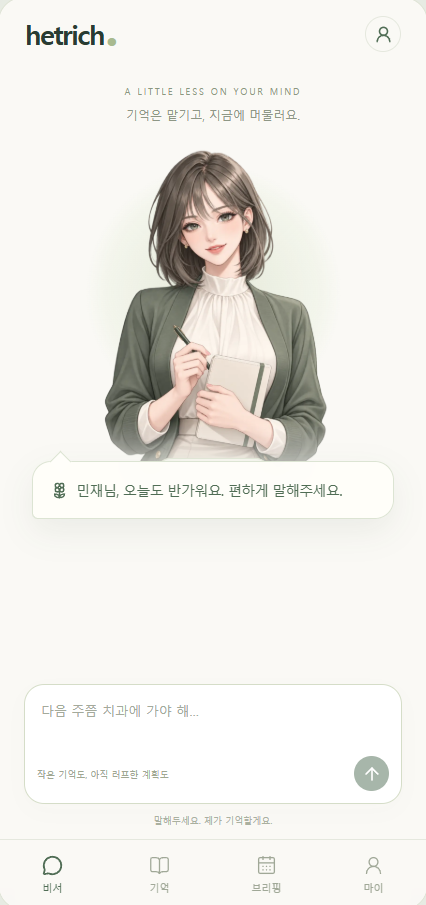
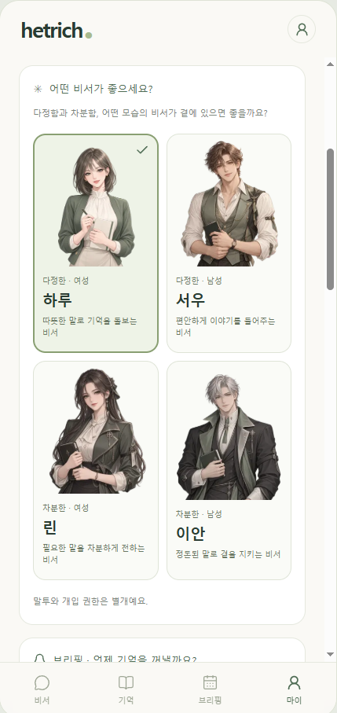
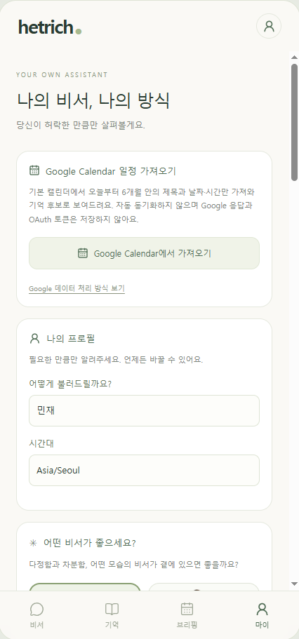

# hetrich.

A LITTLE LESS ON YOUR MIND

**기억은 맡기고, 지금에 머물러요.**

말해두면 기억하고, 신경 써야 할 때 알려주는 개인 비서.

## 왜 만들고 있나요?

해야 할 일 자체보다, 그것을 잊지 않으려고 계속 신경 쓰는 일이 더 버거울 때가 있습니다.

“다음 달쯤 치과에 가야 하는데.” 
“그 약속, 잊으면 안 되는데.”

아직 날짜를 정하지 못한 계획도 머릿속에서는 자리를 차지합니다. 생각하고, 기억하고, 확인하는 데 쓰는 에너지 역시 유한하다고 생각합니다. Hetrich는 그 부담을 조금 덜어, 지금 하고 있는 일과 함께 있는 사람에게 마음을 쓸 수 있도록 만들고 있습니다.

## Hetrich가 지키려는 것

- **정리되지 않은 말도 맡길 수 있게.** 정확한 일정뿐 아니라 “다음 달쯤” 같은 느슨한 계획도 기억으로 받아들입니다.
- **질문 하나도 사용자의 에너지를 쓴다는 생각으로.** 이미 말한 내용을 되묻지 않고, 필요한 확인을 짧게 합니다. 이해한 결과는 확인하고 고칠 수 있게 합니다.
- **판단을 돕되, 판단권은 사용자에게.** 비서의 말투와 별개로, 얼마나 개입하고 언제 알려줄지는 사용자가 정합니다.
- **맡긴 뒤의 부담까지 덜 수 있게.** 기록을 쌓는 데서 끝나지 않고, 필요한 때 다시 떠올릴 수 있는 브리핑과 알림을 지향합니다.

## 화면으로 만나보기

<table>
  <tr>
    <td align="center" width="33%"></td>
    <td align="center" width="33%"></td>
    <td align="center" width="33%"></td>
  </tr>
  <tr>
    <td align="center">편하게 말해두는 자리</td>
    <td align="center">나에게 편안한 비서</td>
    <td align="center">내가 정하는 범위</td>
  </tr>
</table>

개발 중인 화면입니다. 구성과 제공 범위는 달라질 수 있습니다.

홈은 비서와 입력에 집중하고, 저장된 내용은 **기억**, 다시 살펴볼 내용은 **브리핑**, 개인 설정은 **마이**에서 다룹니다. 비서의 외형과 말투를 선택해도 개입 권한이 함께 바뀌지는 않습니다.

Google Calendar는 사용자가 원할 때 기본 캘린더의 오늘부터 6개월 일정 중 제목·날짜·시간을 가져오는 방식입니다. 자동 동기화나 양방향 연동은 하지 않습니다.

[이 생각이 제품의 선택으로 이어지는 과정 →](docs/philosophy.md)

---

이 저장소는 Hetrich의 철학과 일부 화면을 소개하는 공개 공간입니다. 개발 소스와 내부 운영 자료는 별도로 관리하며, 여기에는 공개용 문서와 이미지만 담습니다.
